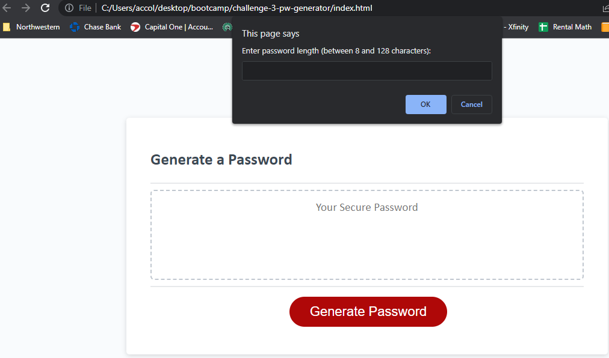

# Challenge 3 - Password Generator

## Description
- Created a password generator that randomizes a password between 8 and 128 characters
- The password generator is able to include 4 character sets: lower case letters, upper case letters, numeric values, and special characters
- The password generator also allows you to pick between 1 and all 4 of the character sets, but will alert you if you do not choose at least 1
- Pressing the "Generate Password" will generate a randomizes password based on the users above inputs of length and which characters to use

## Screenshot
- 

## Deployed Link
- 

## Github Repo Link
- https://github.com/iKingSpacely/challenge-3-pw-generator
